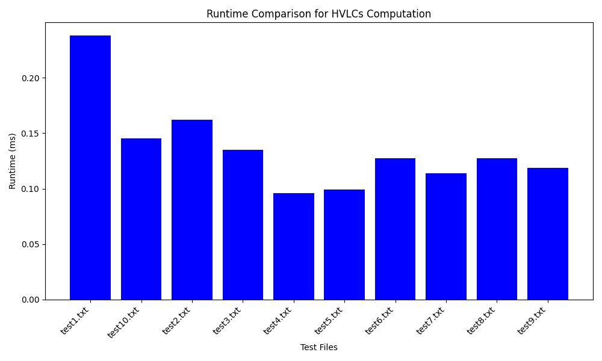

# Programming Assignment 3 - Highest Value Longest Common Sequence

# Team
- Josh Caron, UFID = 40792496
- Joseph Molina, UFID = 37598582

# To compile/build the code
- No compliation or build step required. 
- Ensure Python3.x installed.

```bash
python3 --version
```

# Reproducibility
```bash
git clone <repo-url>
cd Programming-Assignment-3
python3 src/main.py input/test1.txt
python3 src/benchmark.py
```

The first command run (`src/main.py`) prints required output:
- Maximum HVLCS value (part a)
- One optimal subsequence (part b)


The second command run (`src/benchmark.py`) prints runtime for `input/test1.txt` through `input/test10.txt` for use in Q1 below. 

# Program usage
```bash
python3 src/main.py <input_file>
```

Example:

```bash
python3 src/main.py input/test4.txt
```

# Written Component
## Question 1: Empirical Comparison
Use at least 10 nontrivial input files (i.e., contain strings of length at least 25). Graph the
runtime of the 10 files.



## Question 2: Recurrence Equation
Give a recurrence that is the basis of a dynamic programming algorithm to compute the
HVLCS of strings A and B. You must provide the appropriate base cases, and explain why
your recurrence is correct.

    Goal: Find a common subsequence that appears in both strings and has the maximum total value.

    Given two strings A and B and values for each character, we can define the following recurrence:

    OPT(i, j) = maximum value of a common subsequence
            between A1, A2, ... , Ai and B1, B2, ... , Bj

    *Do we need a helper function to calculate the value?*

    Case 1: Both characters match (Ai == Bj):
    - claim value for this character
    - recurse on the remaining strings A1, A2, ... , Ai-1 and B1, B2, ... , Bj-1

    Case 2: Characters do not match (Ai != Bj):
    - we have two options:
    1. exclude Ai and recurse on A1, A2, ... , Ai-1 and B1, B2, ... , Bj
    2. exclude Bj and recurse on A1, A2, ... , Ai and B1, B2, ... , Bj-1
    - take the maximum of these two options

    Case 3: Strings A or B are empty
    - no common subsequence, so value is 0


    Recurrence equation:

                = 0                                        if i == 0 or j == 0
    OPT(i, j)   = value of Ai + OPT(i-1, j-1)              if Ai == Bj
                = max(OPT(i-1, j), OPT(i, j-1))            if Ai != Bj


## Question 3: Big-Oh
Give pseudocode of an algorithm to compute the length of the HVLCS of given strings A
and B. What is the runtime of your algorithm?

Psuedocode:

        def compute_hvlcs(a, b, values)

                String A is defined by characters A_1, A_2, ..., A_n
                String B is defined by characters B_1, B_2, ..., B_m

                M is a 2D array of size n by m where n and m are the lengths of strings A and B. All values are initialized to 0

                for i=1 to n:
                        for j=1 to m:
                        if A_{i-1} equals B_{j-1}:
                                M[i][j] = M[i-1][j-1] + Value of A_{i-1}
                        else:
                                M[i][j] = max{M[i - 1][j], M[i][j - 1]}

                return M[n][m]

Runtime:
- The algorithm uses a 2D array of size n by m where n and m are the lengths of strings A and B.
- The nested loops iterate through each indice of M resulting in a time complexity of O(n * m).
